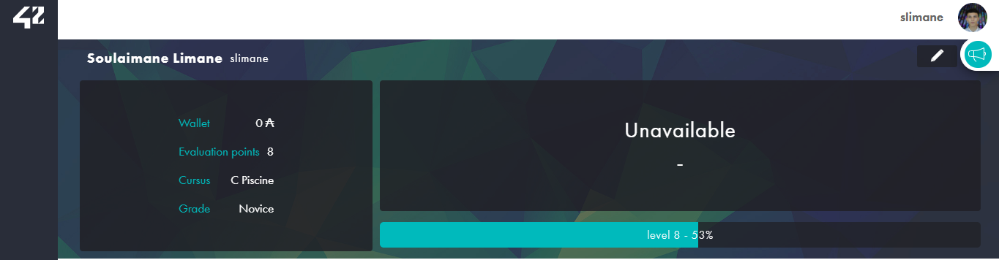

# 1337 Pool

I passed the Pool stage at School 1337, which is a school belonging to Network 42, and these are the projects I completed in Pool.

## Projects and Solutions

| Projects | Solutions |
| --- | --- |
| [Shell00](https://github.com/Soulaimanelimane/1337-Pool/tree/main/Shell00) | 85% |
| [Shell01](https://github.com/Soulaimanelimane/1337-Pool/tree/main/Shell01) | 100% |
| [C00](https://github.com/Soulaimanelimane/1337-Pool/tree/main/C00) | 85% |
| [C01](https://github.com/Soulaimanelimane/1337-Pool/tree/main/C01) | 100% |
| [C02](https://github.com/Soulaimanelimane/1337-Pool/tree/main/C02) | 85% |
| [C03](https://github.com/Soulaimanelimane/1337-Pool/tree/main/C03) | 75% |
| [C04](https://github.com/Soulaimanelimane/1337-Pool/tree/main/C04) | 85% |
| [C05](https://github.com/Soulaimanelimane/1337-Pool/tree/main/C05) | 80% |
| [C06](https://github.com/Soulaimanelimane/1337-Pool/tree/main/C06) | 100% |
| [C07](https://github.com/Soulaimanelimane/1337-Pool/tree/main/C07) | 60% |
| Exam00 | 70% |
| Exam01 | 80% |
| Exam02 | 80% |
| Final Exam | 66% |
